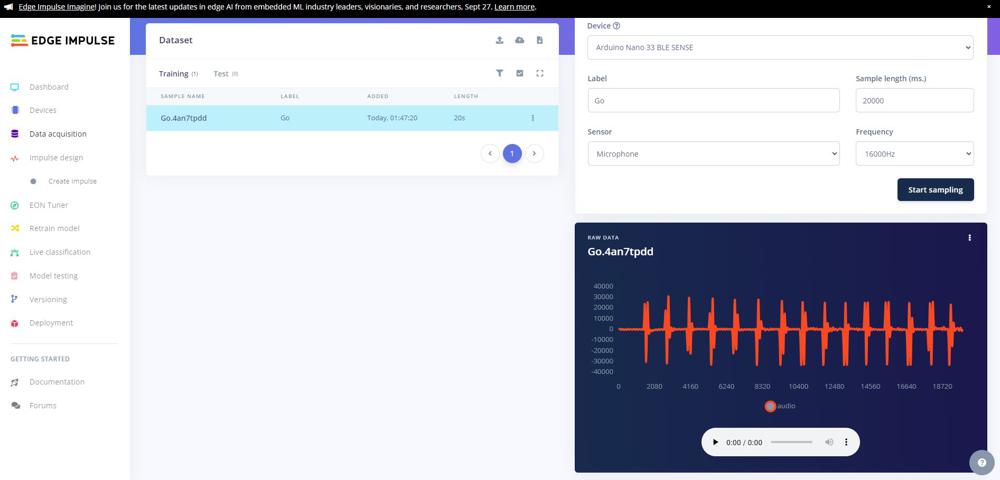

# Arduino Nano 33 BLE SENSE AI Powered Servo With Edge Impulse


Project by [Adam Milton-Barker](https://www.AdamMiltonBarker.com)
Github project [Arduino Nano 33 BLE SENSE AI Powered Servo With Edge Impulse](https://github.com/AdamMiltonBarker/edge-impulse-arduino-nano-33-ble-sense-servo)

# Introduction

Deploying AI models onto resource-constrained devices is now commonplace, yet there's untapped potential in this technology. These devices, often powered by microcontrollers equipped with GPIO (General Purpose Input/Output) pins, hold the key to a broader spectrum of possibilities. With GPIO pins, we can seamlessly connect sensors and actuators to these devices, enabling us to not only obtain insights from AI models but also take tangible actions based on these insights.

The integration of AI models with microcontrollers and their GPIO pins serves as a bridge between digital intelligence and the physical world. It empowers us to translate AI-driven classifications and predictions into real-world responses and interactions.

# Project

The Arduino Nano 33 BLE SENSE AI Powered Servo With Edge Impulse project is one of a series of projects that utilizes the Edge Impulse platform to build and train a keyword detection model, and then use it on a microcontroller to control a servo.

## Hardware

- Arduino Nano 33 BLE Sense [Buy](https://store.arduino.cc/products/arduino-nano-33-ble-sense)
- SG90 Tower Pro servo [Buy](https://www.towerpro.com.tw/product/sg90-7/)

## Platform

-  Edge Impulse [Visit](https://www.edgeimpulse.com)

## Software

- Edge Impulse CLI [Download](https://docs.edgeimpulse.com/docs/edge-impulse-cli/cli-installation)
- Arduino CLI [Download](https://arduino.github.io/arduino-cli/latest/)
- Arduino IDE 2.2.1 [Download](https://www.arduino.cc/en/software)

## Project Setup

Head to [Edge Impulse](https://www.edgeimpulse.com) and create your account or login.

### Install Dependencies

- [Edge Impulse CLI](https://docs.edgeimpulse.com/docs/edge-impulse-cli/cli-installation)
- [Arduino CLI](https://arduino.github.io/arduino-cli/latest/)
- [Arduino Nano 33 BLE Sense installation](https://docs.edgeimpulse.com/docs/development-platforms/officially-supported-mcu-targets/arduino-nano-33-ble-sense)

### Create New Project
From the project selection/creation section you can create a new project.


Enter a **project name**, select **Developer** or **Enterprise** and click **Create new project**.

### Connect Your Device


Connect your device to your computer and press the **RESET** button twice to enter into bootloader mode, the yellow LED should now be pulsating.

Now download the the [latest Edge Impulse firmware](https://cdn.edgeimpulse.com/firmware/arduino-nano-33-ble-sense.zip) and unzip it, then double click on the relevant script for your OS either `flash_windows.bat`, `flash_mac.command` or `flash_linux.sh`.

Once the firmware has been flashed you will should see the output above, hit enter to close command prompt/terminal.

Open a new command prompt/terminal, and enter the following command:

```edge-impulse-daemon```

If you are already connected to an Edge Impulse project, use the following command:

```edge-impulse-daemon --clean```

You will be asked to log in to your Edge Impulse account and then select the COM port that your device is connected to.

## Data Acquisition

Now comes the fun part. We are going to create our own keyword dataset using the built in microphone on the board. This data will allow us to train an AI model that is capable of identifying when we say **Go** and **Stop**.

We will use the **Record new data** feature on Edge Impulse to record 15 sets of 15 utterences of each of our keywords, and then we will split them into individual samples. Ensuring your device is connected to the Edge Impulse platform, head over to the **Data Aqcquisition**.


Select your device then select **Built in microphone**, set the label as **Go**, change the sample length to 20000 (20 seconds), and leave all the other settings as is. Make sure the microphone is close to you, click **Start sampling** and record yourself saying **Go** 15 times.



You will now see the uploaded data in the **Collected data** window, next we need to split the data into ten individual samples. Click on the dots to the right of the sample and click on **Split sample**, this will bring up the sample split tool. Here you can move the windows until each of your samples are safely in a window. You can fine tune the splits by dragging the windows until you are happy, then click on **Split**


You will see all of your samples now populated in the **Dataset** window.


Now you need to repeat this action 14 more times for the **Go** class, resulting in 225 samples for the Go class. Once you have finished, repeat this for the remaining **Stop** class. You will end up with a dataset of 450 samples, 225 per class.


After we finish recording and splitting, we still need a little more data. We need a **Noise** class that will help our model determine when nothing is being said, and we need an **Unknown** class, for things that our model may come up against that are not in the dataset.

For the noise class record 75 samples with no speaking and label them as **Noise**.


Next download the [Edge Impulse keywords dataset](https://cdn.edgeimpulse.com/datasets/keywords2.zip) and extract the data. Copy 150 samples from the **Noise** folder and upload to the Edge Impulse platform by going to the **Data Acquisition** tab and uploading the new data, then copy 225 samples from the unknown class and  into the **Unknown** class.


You should now have 900 samples in your training data.

### Split Dataset


We need to split the dataset into test and training samples. To do this head to the dashboard and scroll to the bottom of the page, then click on the **Perform train/test split**


Once you have done this, head back to the data acquisition tab and you will see that your data has been split.

## Create Impulse

Now we are going to create our network and train our model.


Head to the **Create Impulse** tab and click **Add processing block** then select **Audio (MFCC)**, then click **Add learning block** and select **Classifier**. Now click **Save impulse**.

### MFCC Block

#### Parameters


Head over to the **MFCC** tab and click on **Autotune parameters** and then **Save parameters** to save the MFCC block parameters.

#### Generate Features

If you are not automatically redirected to the **Generate features** tab, click on the **MFCC** tab and then click on **Generate features** and finally click on the **Generate features** button.


Ideally your data will be nicely clustered with minimal mixing of the classes.

## Training


Now we are going to train our model. Click on the **Transfer Learning (Keyword Spotting)** tab then click **Start training**.

Once training has completed, you will see the results displayed at the bottom of the page. Here we see that we have 98.6% accuracy. Lets test our model and see how it works on our test data.

## Testing

### Platform Testing

Head over to the **Model testing** tab where you will see all of the unseen test data available. Click on the **Classify all** and sit back as we test our model.


You will see the output of the testing in the output window, and once testing is complete you will see the results. In our case we can see that we have achieved 97.84% accuracy on the unseen data, and a high F-Score on all classes.

### On Device Testing


Now we need to test how the model works on our device. Use the **Live classification** feature to record some samples for clasification. Your model should correctly identify the class for each sample.


In our case, the model classifies well, correctly identifying each keyword each time.

## Deployment


Now we will deploy the model to the Nano 33 BLE SENSE. Head the **Deployment** page and select **Arduino Library** from the deployment options then click build.

Wait for the firmware to build and then download it when prompted.

## Circuit


Follow the diagram above to connect your servo to the Arduino. See below for pin map.

| Arduino Pin | Servo Pin |
| ---------- | ---------- |
| D8 | Control (Yellow) |
| 5v | VCC (Red) |
| GND | GND (Black) |

## Arduino IDE


Once you have downloaded the library, open up Arduino IDE, click **Sketch** -> **Include library** -> **Upload .ZIP library...**, navigate to the location of your librar upload it and restart the IDE.

Now open [libraries/nano_ble_33_sense_ei_servo/nano_ble_33_sense_ei_servo.ino](libraries/nano_ble_33_sense_ei_servo/nano_ble_33_sense_ei_servo.ino "libraries/nano_ble_33_sense_ei_servo/ai_patient_assistance_continuous.ino") and change the following line (Line 47):

```
#include <AI_Keyword_Powered_Servo_inferencing.h>
```
to match the name of your project. If you are unsure what to use here you can go to **Your Project** -> **nano_ble33_sense** -> **nano_ble33_sense_microphone_continuous** in the examples tab of Arduino IDE and find the correct include name at the top of the file.


Now you can upload the script and once the script is uploaded open up serial monitor and you will see the output from the program. When you say `Go` the servo will turn to the right, when you say `Stop` the servo will turn to the left. You should notice that when you do  not say the keywords, the classification will be `Noise` or `Unknown`.

# Conclusion

In this project, we offer a comprehensive guide to swiftly develop an efficient keyword detection model using the Edge Impulse platform and seamlessly implement it on the Arduino Nano 33 BLE SENSE device. This practical demonstration emphasizes a simplified yet highly effective approach to incorporating artificial intelligence into tangible, real-world applications.

By harnessing the power of AI model classifications, we showcase how you can bridge the gap between the digital and physical realms, enabling seamless interaction with the environment. This project serves as a valuable starting point for enthusiasts and developers looking to explore the potential of Edge Impulse and its applications. It offers a solid foundation upon which to build more intricate projects, underscoring the adaptability and scalability of the Edge Impulse platform in driving innovation.